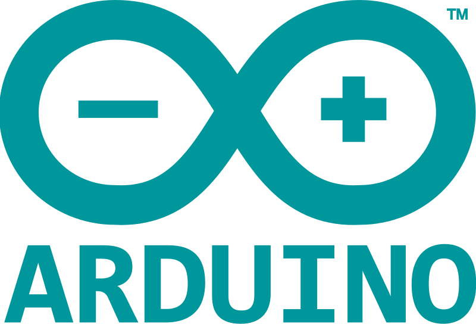

## Arduino : qu'est ce ?


<figure style="position: absolute; top: 350px; right: 0; width: 40%">
    
</figure>

**http://www.arduino.cc/** et **http://www.arduino.org/**
> Arduino is an open-source prototyping platform based on easy-to-use hardware and software.

<br>

- Fondé en 2008
- Caractéristiques d'un Arduino Micro
 - Microcontroleur ATMEL 8 bit @ 16 MHz
 - 32 *Ko* de Flash
 - 2.5 *Ko* de RAM + 1 *Ko* de EEPROM
 - 20x E/S numériques
 - 12x E/S analogiques
 - Tarif : &asymp; 5 &rarr; 30 €


## Arduino

- Philosophie "Open hardware"
 - Shéma electronique libre
 - Logiciels libres et gratuits :
   - bootloader ( &asymp; "bios/UEFI d'un PC" )
   - SDK + chaine de cross compilation + IDE simple
- Logiciels
 - Pas de système d'exploitation
 - Uniquement le programme s'exécute dessus.
 - Gestion des interruptions à coder si necessaire
 - Le debug se fait à coup de reboot et à la LED...
 - <span style="color: #0000aa">Pas de BSOD :'(</span>

<figure style="position: absolute; top: 500px; right: 0; width: 30%">
   
</figure>


## Raisons du succès ?
<br>

> Pour programmer un micro-contrôleur, <br>il faut un micro-contrôleur programmé...

<br>
*Problème de la poule et l'oeuf*

<figure style="position: absolute; left: 300px; top: 250px">
    
</figure>


## Connexion

- USB avec un PC
- Alimentation de la carte
- Port série émulé sur USB
- Le SDK fournit des primitives<br> de communication série
- Coté hôte, il suffit d'ouvrir un<br> terminal série
    - soit celui de l'IDE
    - ```cu``` sous linux
    - ```screen``` sous OS X

<figure style="position: absolute; top: 170px; left: 470px; width: 60%">
   
</figure>
