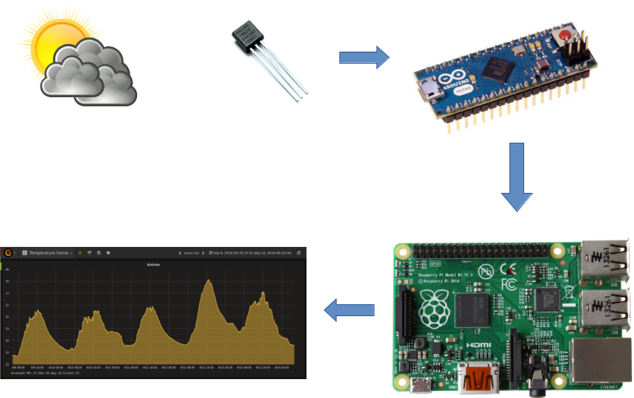
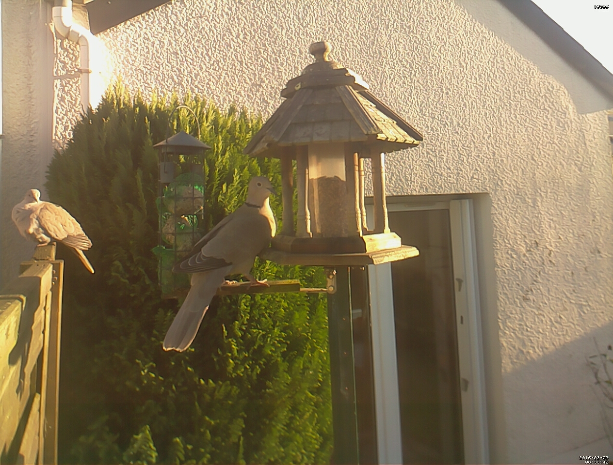

<!-- .slide:  -->

<h1 style="background: no-repeat url('ressources/pcb.jpg') !important;">
 
Construire une station&nbsp;météo en Node.js avec un Raspberry Pi  et un Arduino
      
</h1>

## Vue d'ensemble

<!-- .slide: id="master-toc" class="toc" -->

<figure style="position: absolute; top: 50px; width: 100%; left: 0px;">
    
</figure>
     
*Le tout sans écrire une ligne de C !*

## Qui suis-je ?

- **Guillaume Membré**

- Consultant et formateur chez *Zenika Nantes*
 - Mise en place de démarche dev-ops
 - Développeur Java depuis 10 ans, en transition sur du grails *<i class="fa fa-thumbs-up"></i>*

- Mes hobbies : DIY, Raspberry Pi,  Arduino...
  
**http://www.monbook.tech**
 
**https://github.com/gmembre-zenika/**
 
**https://gitlab.com/coliss86/**

<figure style="position: absolute; top: 50px; width: 40%; right: 0px;">
    
</figure>

<figure style="position: absolute; top: 330px; width: 50%; right: 0px;">
    
</figure>
