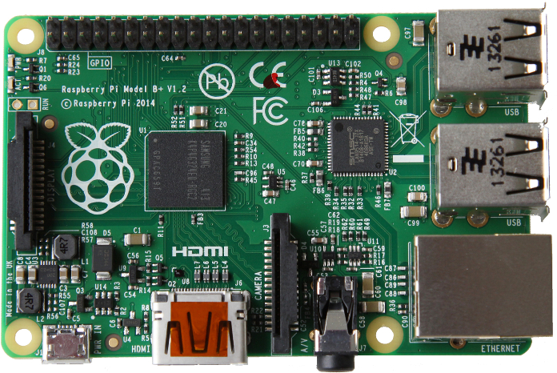

## Raspberry Pi
**http://www.raspberrypi.org**

- 1er exemplaire distribué en février 2012, 10 millions d'unités vendu depuis
- Spécifications (modèle V2):
  - CPU Arm A7@900 Mhz Quad core
  - 1 Go de ram
  - 4xUSB 2.0
  - 1 eth 100 Mbit/s (bridge USB)
  - gpio, port caméra, HDMI...
- Tarif : &asymp; 45 €

<figure style="position: absolute; top: 300px; margin-left: 450px;  width: 50%">
    
</figure>

## Usages

- &asymp; Mini pc
- Compagnon idéal du bidouilleur en herbe
 - petite taille, faible consommation donc embarquable facilement
 - HTPC, robot, mangeoire d'oiseau, clusters Docker, sur laboratoire sur la station spatiale *<i class="fa fa-space-shuttle"></i>*...

## OS et logiciels
- Sous linux :
  - Raspbian = port non officiel d'une debian sur *armhf*   **http://www.raspbian.org**
  - Archlinux
- et Windows 10...
- Communauté très active
 - Le projet Raspbian produit plus de paquets que le port officiel Debian

<figure style="position: absolute; top: 150px; right: 250px; width: 6%;">
    
    
</figure>

## Comparaison avec du matériel connu

|  Plateforme | CPU                                                       | RAM  | Flash |
|-------------|-----------------------------------------------------------|------|-------|
| Arduino     | Atmel@16 Mhz                                              | 2&nbsp;*Ko* |   32&nbsp;*Ko*  |
| Rpbi 2      | Arm A7@900 Mhz Quad core                                  | 1&nbsp;Go | -     |
| Samsung S4  | Arm A15@1.6 GHz Quad&nbsp;core +  Arm A7@1.2 Ghz Quad&nbsp;core | 2&nbsp;Go | 16&nbsp;Go |
| MBP         | Intel i5 x86_64@2.7 Ghz Quad&nbsp;core | 8&nbsp;Go | 250&nbsp;Go |

 
Consommation en Idle

| Plateforme | Idle (W)  | Burn (W)
|------------|-----|-----|
| Arduino    | 0.170 (&rarr; 0.011) | 0.2 |
| Rpbi 2     | 1.1  |  4.5 |
| Tour de gamer | - | 600-1000 W |

 
*Idle* : Pas d'activité CPU
 
*Burn* : Taux d'occupation CPU de 100%
