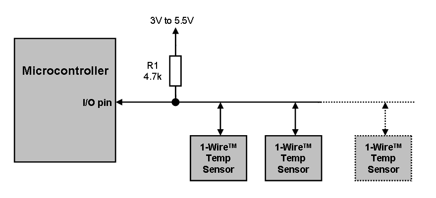
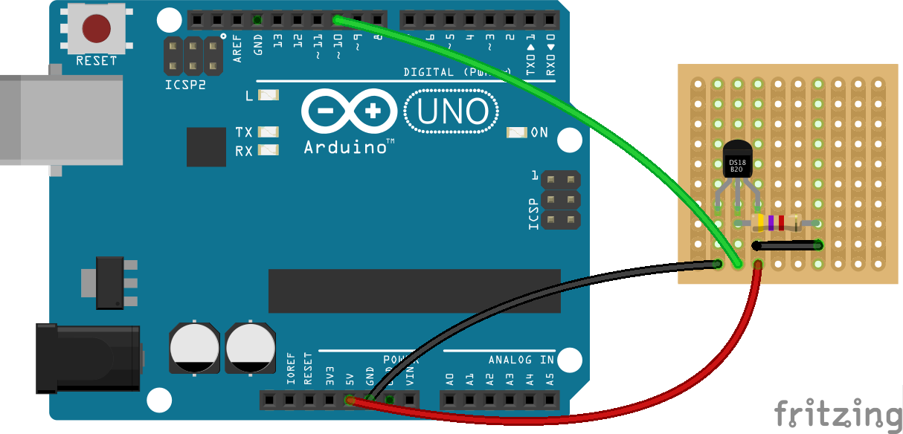
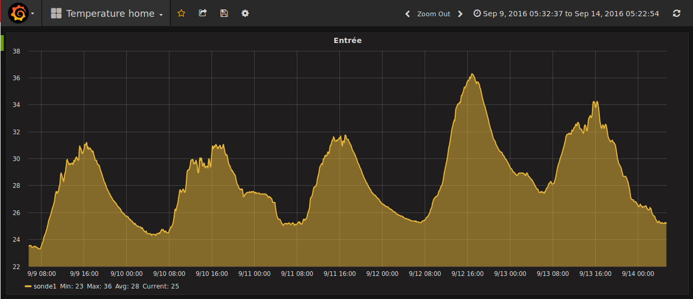
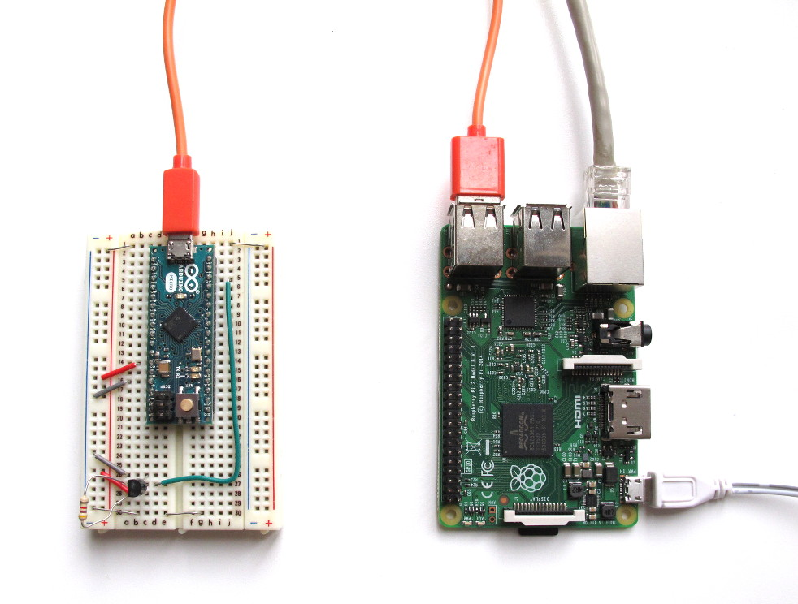
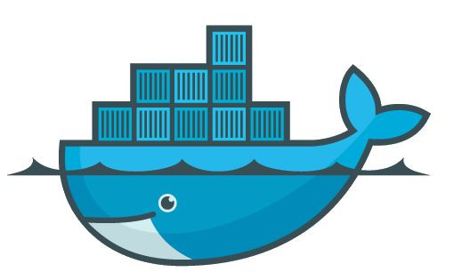
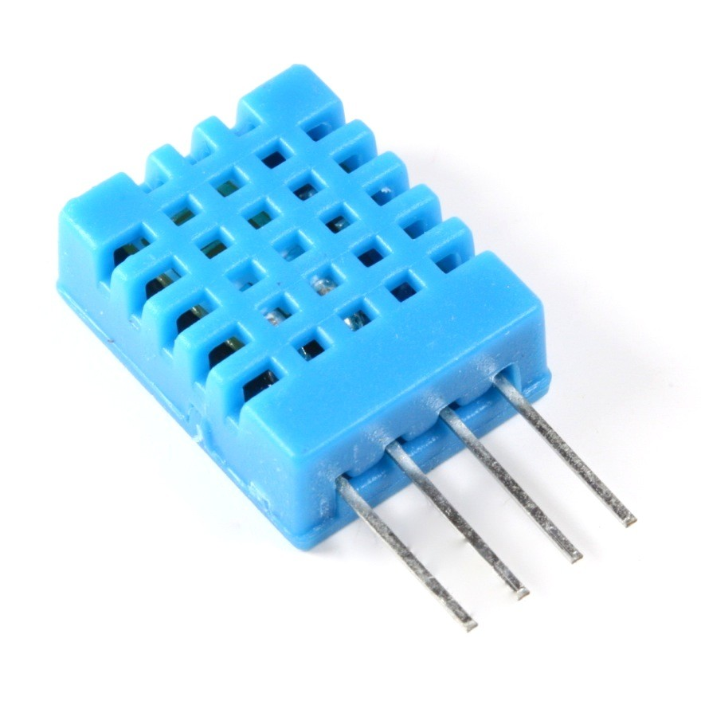
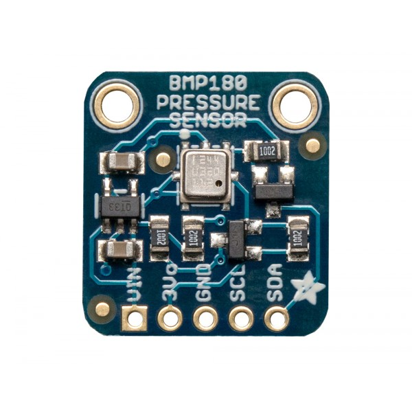

## Thermomètre

- Sonde de température *DS18B20*
- Caractéristiques :  -55°C &rarr; +125°C, Résolution 9/12-bit
- Bus *1 Wire*, développé dans les années 90
  - 3 fils (+5V, masse, data), longeur max : 100 m
  - chaque composant à une adresse unique en 64 bit

<figure style="position: absolute; top: 70px; right: -100px; width: 50%">
    
</figure>

<figure style="position: absolute; top: 370px; left: 170px">
    
</figure>


## Utilisation

- Montage très simple
- sketch : ~110 lignes &rarr; 8,5 ko de flash, ~360 octets de RAM
- exemple de sortie :

```
ROM = 28 65 DC 33 4 0 0 17
  Chip = DS18B20
  Data = 1 43 1 4B 46 7F FF D 10 BD  CRC=BD
  Temperature = 20.19 Celsius, 68.34 Fahrenheit
```

<figure style="position: absolute; top: 400px; left: 170px; width: 70%">
    
</figure>


## Limites de l'Arduino

- L'Arduino dispose de très peu de ressources
  - Contraintes : le programme doit tenir dans 32 Ko de flash et 2,5 Ko de RAM...
  - Exemples : relevé de sondes de temperatures et pilotage de radiateur, drône quadricoptère, machine enigma...
  - Connectivité avec le monde extérieur très limitée (pas d'eth ou wifi sur les modèles les plus simple)
- Dès qu'il s'agit de faire plus intelligent (robot autonome, reconnaissance de voix, graphique temps réel...) une CPU plus puissante va être nécessaire.

<br>

*<i class="fa fa-lightbulb-o" style="font-size: 200%; color: orange"></i>* Utiliser un hôte qui utilise l'Arduino comme un esclave en lui émettant des ordres via le port série


## Communication série

- 1ère solution : communiquer directement avec le port série en émettant des ordres en format texte
  - Simplicité : <i class="fa fa-star" style="font-size: 150%; color: orange"></i><i class="fa fa-star" style="font-size: 150%; color: orange"></i><i class="fa fa-star-o" style="font-size: 150%; color: orange"></i>
  - Documentation : <i class="fa fa-star" style="font-size: 150%; color: orange"></i><i class="fa fa-star" style="font-size: 150%; color: orange"></i><i class="fa fa-star" style="font-size: 150%; color: orange"></i>
  - Evolutivité : <i class="fa fa-star" style="font-size: 150%; color: orange"></i><i class="fa fa-star-o" style="font-size: 150%; color: orange"></i><i class="fa fa-star-o" style="font-size: 150%; color: orange"></i> (maintient du code Arduino et hôte)
  - Exemple de sketch : **https://gitlab.com/coliss86/arduino-controller**

```
> h
    ___          _       _
   / _ \        | |     (_)
  / /_\ \_ __ __| |_   _ _ _ __   ___
  |  _  | '__/ _` | | | | | '_ \ / _ \
  | | | | | | (_| | |_| | | | | | (_) |
  \_| |_/_|  \__,_|\__,_|_|_| |_|\___/

Help
Command available :
      h - help
      t - temperature
```


## Solution plus évoluée

- Utiliser un protocole binaire d'échange sur le port série
 - Transmission plus fiable
 - Sketch spécifique sur l'Arduino
 - Librairies clientes coté hôte
<br><br>
 - Simplicité : <i class="fa fa-star" style="font-size: 150%; color: orange"></i><i class="fa fa-star-half-o" style="font-size: 150%; color: orange"></i><i class="fa fa-star-o" style="font-size: 150%; color: orange"></i>
 - Documentation : <i class="fa fa-star" style="font-size: 150%; color: orange"></i><i class="fa fa-star" style="font-size: 150%; color: orange"></i><i class="fa fa-star" style="font-size: 150%; color: orange"></i>
 - Evolutivité : <i class="fa fa-star" style="font-size: 150%; color: orange"></i><i class="fa fa-star" style="font-size: 150%; color: orange"></i><i class="fa fa-star" style="font-size: 150%; color: orange"></i>


## Librairies

- *Firmata* : **https://github.com/firmata/arduino**
  - Protocole très similaire au MIDI (commande de 8 bits, data : 7 bits)
  - Implémentation pour plusieurs micro-contrôleurs
  - Sketch rendant l'Arduino esclave d'un hôte<br>&rArr; l'Arduino n'est plus autonome
  - Documenté, libre et open source

- *Johnny-five* : **http://johnny-five.io/**
  - Lib Node.js s'interfacant avec ce protocole
  - Documentée, illustrée, libre et open source

<br>
*&rArr;* Le Raspberry Pi exécutera le programme en Node.js<br> pour piloter l'Arduino

<figure style="position: absolute; top: 300px; width: 50%; right: -100px;">
    
</figure>


## Johnny-five

- *Johnny-five* intègre une API de très haut niveau s'interfaçant avec :
 - de nombreux composants du marché : servo, relais, moteur pas à pas, altimètre, LCD...
 - les bus les plus répandu : I2C et OneWire
- Hello world :

```javascript
var five = require("johnny-five");
var board = new five.Board();

board.on("ready", function() {
  var led = new five.Led(13);

  // change l'état de la LED toutes les 500 ms
  led.blink(500);
});
```


## Relevé de température

- Mise en oeuvre avec la sonde

```javascript
board.on("ready", function() {
  var thermometer = new five.Thermometer({
    controller: "DS18B20",
    pin: 10,
    freq: 1000
  });

  thermometer.on("data", function() {
    console.log(this.celsius + "°C");
  });
});

```

Note : le code équivalent pour Arduino fait 100 lignes avec :
```C++
int16_t raw = (data[1] << 8) | data[0];
if (type_s) {
  raw = raw << 3;
  if (data[7] == 0x10) {
    raw = (raw & 0xFFF0) + 12 - data[6];
    ...
}}
```


## Graphiques

- L'objectif final est de tracer des courbes de température

- *Influxdb* : **https://www.influxdata.com/**
 - base nosql temporelle : les données sont indexées sur un timestamp précis la nanoseconde
- *Grafana* : **http://grafana.org/**
 - Tableau de bord compatible avec de nombreuses sources de métriques
 - Mise en forme des données sous forme de graphique

<figure style="float: right; width: 8%; margin-top: -370px">
   
   <br>
   
</figure>

<figure>

</figure>


## All together

- Assemblage électronique

<figure style="position: absolute; top: 150px; width: 80%; ">
    
</figure>


## All together

- *Grafana* et *Influxdb* sont déployés sous forme de conteneurs *Docker* sur le *Raspberry Pi*
<br><br>*<i class="fa fa-warning" style="font-size: 150%"></i>* Obligation de reconstruire les images from scratch car les images disponible sur le Docker Hub sont en très grand majorité pour *x86 amd64* et non *armhf*

<figure style="position: absolute; top: 400px; right: -150px; width: 80%; ">
    
</figure>


## Et ensuite ?

- A ce niveau, il va devenir aisé d'ajouter des nouveaux capteurs :
  - *DHT11* : mesure d'humidité
  - *BMP180* : capteur de pression atmosphérique
  - Capteur d'humidité de sol
  - ...

<figure style="position: absolute; top: 100px; right: 0px; width: 20%; ">
    
</figure>

<figure style="position: absolute; top: 300px; right: 0px; width: 20%; ">
    
</figure>


## Démo

<figure style="margin-top: 0%; margin-left: 15%; width: 70%">
    
</figure>
